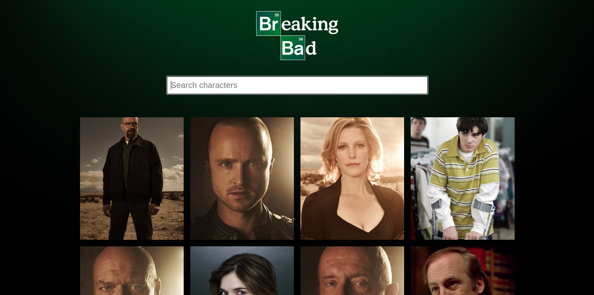

# Breaking-Bad-Wiki
Simple React application which lists down all the characters from the popular TV Show Breaking Bad providing information about each character.

# Features 

1. Uses the React Hook useEffect to make an API call to a third party API ( https://breakingbadapi.com/ ). 
2. Fetches data like Name, Image, Occupation, etc and displays them on hover of cards.
3. Loading spinner added to enhance UX.

# Screenshot


# Built with 
1. React Hooks

# Live Demo at 
https://breakingbadwiki.netlify.app/

# To Run 
1. Clone into repo
2. Run ``` npm i ```
3. Run ``` npm start ```
4. Visit ``` localhost:3000 ```
